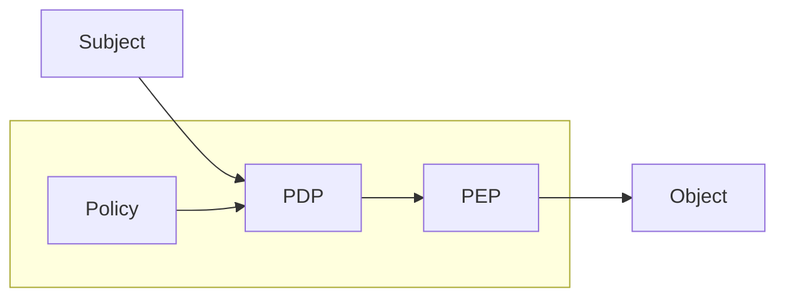

# Safety

> [!IMPORTANT]+ Definition
> The probability that a system:
> - Will either perform its function correctly
> - Or will discontinue its function in a manner that
> 	- Does not disrupt the operation of other systems
> 	- Does not compromise the safety of any people associated with the system
> 
> Safety mainly deals with people and the environment.

Safety critical systems are governed by an extensive set of **strict international standards.** Lack of compliance in safety-critical domains is a serious engineering fault (no shit).

> [!SUMMARY]- Whatever convoluted graph this is about standards
> ![[Pasted image 20260402005137.png]]

# Security
> [!TIP]+ Definition
> Computer security deals with the prevention and detection of unauthorized actions by users of a computer system.

> [!WARNING]+ Authorization
> Security policies state who has the authorization to do what in a system. They are the cornerstone of the definition of "Computer Security".

> [!BUG]+ Physical and Logical Security
> Computer security must be both **physical** and **logical**.
> 
>
>
> | Physical Security                                                                               | Logical Security                                                                                                           |
> | :---------------------------------------------------------------------------------------------- | :------------------------------------------------------------------------------------------------------------------------- |
> | **Access control**<br>- access to Buildings<br>- offices and desks                              | **Access and perimeter**<br>- perimeter protection                                                                         |
> | **Environmental protection**<br>- fire protection system<br>- protection against natural events | **System protection**<br>- endpoint / server protection                                                                    |
> | **Infrastructure continuity**<br>- electrical continuity                                        | **Operational continuity**<br>- Business Continuity Plan (BCP)<br>- Backup & Disaster Recovery<br>- Primary / backup links |

---
## Cybersecurity
> [!TIP]+ Definition
> Cybersecurity deals with international, intelligent and adaptive threats acting through cyberspace. It differs from regular security via the environment in which these threats operate.

---
# Failure
> [!ERROR]+ Threat Chain
> The chain of events that describes how failures emerge.

### Failure in the Safety Community

> [!CHECK]+ The 3-Universe Model
> 
> ```mermaid
> graph TD
> Fault-->Error-->Failure
> 
> Fault["Fault - Physical Domain"]
> Error["Error - Information Domain"]
> Failure["Failure - User Domain"]
> ```

An example is with ABS in a car:
- Fault:
	- A wheel speed sensor is damaged
- Error:
	- Incorrect wheel speed data is received by ECU
- Failure
	- ABS fails to deploy when needed.

### Failure in the Software Community

> [!CHECK] Software Threat Chain
>
>```mermaid
>graph LR
>Weakness-->Vulnerability-->Attack
>```

### Comparisons

| Community | Cause | Chain |
| :--- | :--- | :--- |
| Safety | Accidental | Fault → Error → Failure |
| Software | Human error | Error → Bug / Fault → Failure |
| Security | Adversary | Weakness → Vulnerability → Attack |

---
# Safety vs Security
> [!EXAMPLE]+
> A safety requirement for a car can be that doors shall open if the car is flipped.
> 
> A solution is to install pressure sensors on the roof of the car.
> 
> However this has security issues, since someone can jump on the roof of the car, forcing the doors to open.

We must design anything with both safety and security in mind - (Safety & Security)-by-Design.

| Detail                          | Safety                                                                                                                                                                                                                                                 | Security                                                                                                                                                                                                                                                      |
| :------------------------------ | :----------------------------------------------------------------------------------------------------------------------------------------------------------------------------------------------------------------------------------------------------- | :------------------------------------------------------------------------------------------------------------------------------------------------------------------------------------------------------------------------------------------------------------ |
| Accidentality vs Intentionality | The threat is always an accidental event that can be:<br>- *Endogenous* (e.g., component failure)<br>- *Exogenous* (e.g., atmospheric event, or electromagnetic noise)<br>- *Human*, but unintentional (e.g., error in design, manufacturing, testing) | The threat is usually carried intentionally by a malicious agent (human or system).                                                                                                                                                                           |
| Cardinality                     | - Failures arise from **limited combinations of accidental events**<br>- Faults may exist in many systems, but **manifest sporadically**<br>- Only a small number of systems experience the failure at a given time                                    | - Modern systems often share common software components<br>&nbsp;&nbsp;&nbsp;&nbsp;- a single vulnerability may allow attackers to compromise **thousands or millions of systems very quickly**<br>- Attackers can exploit them simultaneously at large scale |

---
## Failure Prevention
- Safety: Aims to prevent accidental faults via Fault-Tolerant Architectures, relying heavily on redundancy (Time, Information, Functional, Structural).
- Security: Aims to prevent malicious exploitation via Vulnerability-Tolerant Architectures (defence in depth, isolation, least privilege). Maps directly to protecting the CIA triad.

> [!WARNING]+ Standards
>Safety and security standards are increasingly converging to create robust systems:
>- IEC 61508: Basic Safety Standard
>- IEC 62443: Security for industrial sectors
>- ISO 27000: Security for tertiary sectors

> [!TIP]+ Dependability
>The overarching umbrella covering both Safety (protecting people/environment) and Security (protecting data/cyberspace). It simply means a system can be justifiably relied upon.
>- Elements: Attributes (reliability, safety, security, maintainability), Threats, and Means (mechanisms to boost robustness).

> [!TIP]+ Resilience
While dependability is about reliability, resilience is about surviving when things inevitably go wrong. It is the ability to prepare for, absorb, recover from, and adapt to disruptions or attacks.

---
## Consequences of Pervasive Cyberspace

$$
\text{More Data}+\text{More Connectivity}\implies\text{More exposure, interference, impact}
$$

> [!DANGER] Security is about ecosystems rather than individual systems.

> [!TIP]+ Data vs Information
> Data is the raw unprocessed bits, while the information is what is infered from the data after processing and analysis.

> [!WARNING]+
> Information can also be inferred without direct data. With the use of summaries, averages, statistics or partial data analysis, one can infer the missing data and therefore understand the information behind it, which can lead to a privacy leak.
> This can be easily done via machine learning, so seemingly harmless data can potentially be put together into harmful privacy violations.

---
# Threat Model: Source-Destination
A message/service flows from a source to a destination.

[](https://mermaid.live/edit#pako:eNpFj0trwzAQhP-K2JMNdpDjZwUOCc2plByaW9FFldcPYktBlmlT4_9ey5R2b8PMfMPOIHWFwCAMQ66kVnXXMK7Ier146Mky7G9cbW7d60_ZCmPJ6xtX3F4976onI9H3y7K8lOXh7HlnHG2nhO208n2XuhCMjmF4ICenTp53slbIG5pf-ziTsRV3ZKQOZWdksA5_YM8Ih5dJSQfiQBaXXUEzEaobNvxaEKN1DgTQmK4CVot-xAAGNINwGmb3Cgfb4oAcHLMS5saBq2Ut3YV613oAZs201oyemvYPMt0rYfHcicaI_wiqCs2znpQFFuX5xgA2wxewmNJdksXZPqZJVuRpAI8ts0vyNIuyJE1pXkT7JYDvbZTu0ihK4yR7ovs4o2lRLD9sJ3ym)

The attacker may:
- Read (eavesdrop)
- Modify (tamper)
- Block (deny)
- Inject (forge)

To avoid all the above, we must use layered controls (defence-in-depth) to protect the communication, examples are:
- Encryption
	- Ensures confidentiality
- Message authentication codes
- Digital signatures
	- Ensures integrity, authenticity and non-repudiation

> [!BUG]+ Cryptographic Hash Functions
> A hash function inputs a message, file or piece of data and returns a hash value of fixed length (digest), which is easy to calculate, but extremely hard to reverse. This can be used to verify the integrity of the data. An example is SHA-256, used for files.
> 
> Hashes can also detect accidental changes.

> [!CHECK]+ How message Authentication Codes Work
> ![[Pasted image 20260403013008.png]]

> [!CHECK]+ How Public-Key Digital Signatures Work
> ![[Pasted image 20260403013157.png]]

---
## Access Control
> [!IMPORTANT]+ Access control is obviously important to avoid risks and threats.



- Subject: user, process, device requiring access to a resource.
- Policy Decision Point (PDP): evaluates the policies which apply to the subject and the object and decides whether access should be granted for that specific operation.
- Policy Enforcement Point (PEP): component capable to enforce the decision.
- Object: resource requested by the subject.

> [!EXAMPLE]+ Access Control Models
> 
> | Model | Full Name                      | Decision Basis                                     |
> | :---- | :----------------------------- | :------------------------------------------------- |
> | DAC   | Discretionary Access Control   | Identity of subject and ownership of object        |
> | MAC   | Mandatory Access Control       | Security labels and classification levels          |
> | RBAC  | Role-Based Access Control      | Assigned organizational roles                      |
> | ABAC  | Attribute-Based Access Control | Attributes of subject, object, action, environment |
