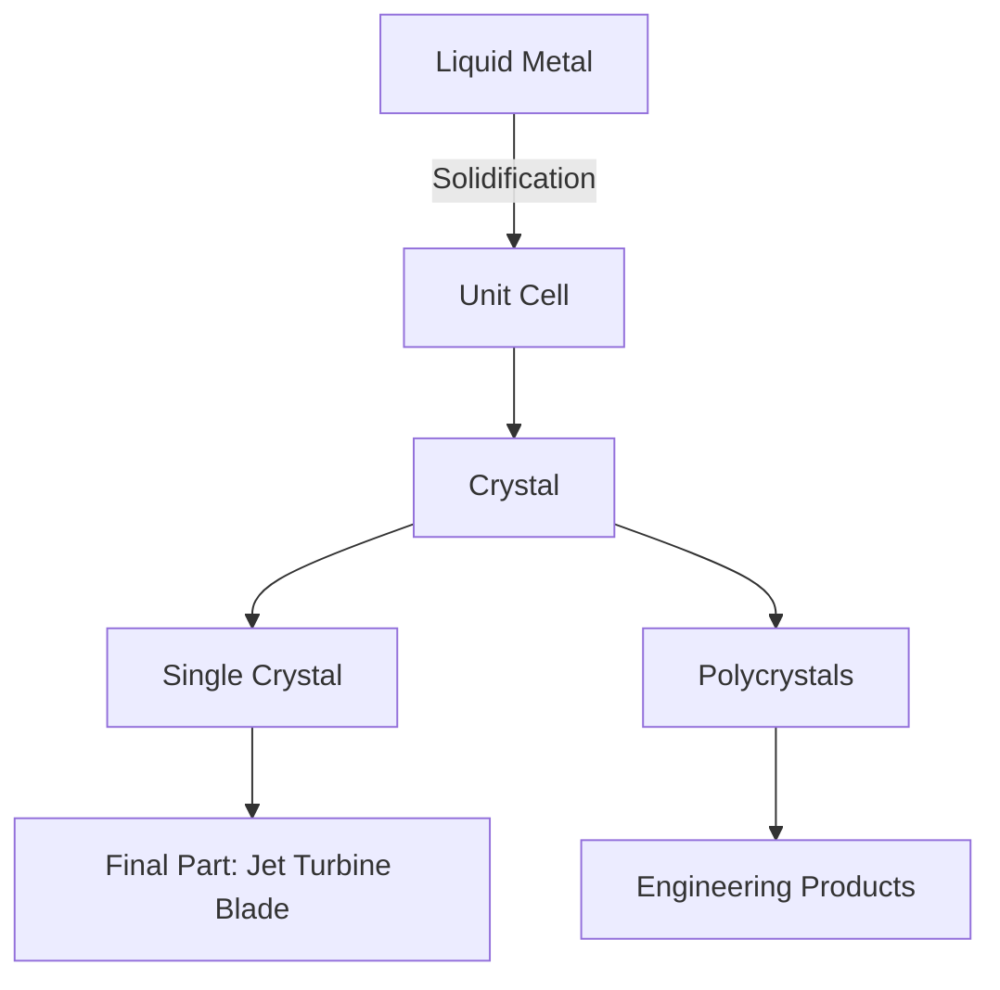
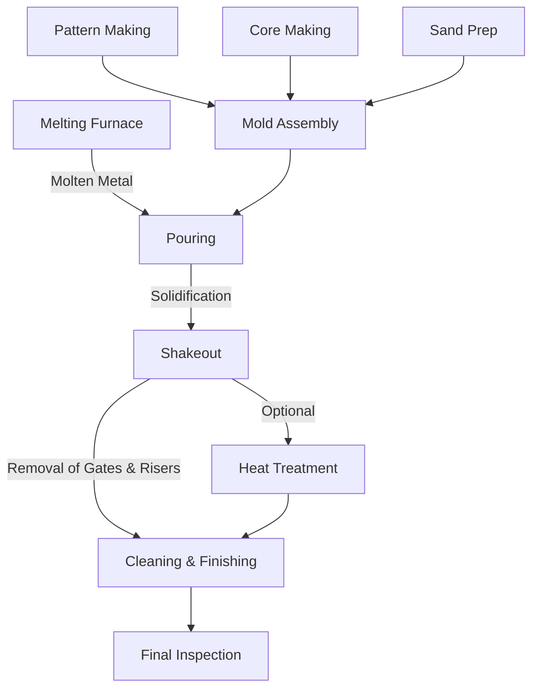

# Sand Casting

# Relevant Shaping Methods
![[Pasted image 20260127131410.png]]
# Embodied Energy
> [!Definition]
> Embodied Energy is the energy required to get the required material in $MJ Kg^{-1}$ to produce the material in a raw shape.

![[Pasted image 20260127132203.png]]
> The above graph shows the cost of acquiring different materials, both in $€/Kg$ and in embodied energy.

# Microstructure Control
We recall the Hall-Pitch relationship that describes yield strength's relationship with grain size:

$$
\sigma_{y}=\sigma_{0}+\frac{k}{\sqrt{ d }}
$$

We can therefore say that a decreased grain size $d$ will increase yield strength $\sigma_{y}$. We should therefore produce the material with grains as small as possible if we need to maximize $\sigma_{y}$.

## Severe Multi-Directional plastic Deformation
![[Pasted image 20260127133434.png]]
> The process of severe multi-directional plastic deformation involves inducing plastic deformation over and over onto a material sample, crushing the existing grains into smaller and smaller sizes.
> The equipment in the photo is usually found in a lab to produce samples for testing. However, the method is also used for production.

## $nc$ Metals by Electrodeposition
To ensure that a material has extremely small grains from the start, electrodeposition can be used. 

This process involves adding a seed to a solution of the metal ion and using electricity to cause deposition of the ion on the seed (and after the reaction started on the sample) which is then neutralized by the current.

Electrodeposition leads to metals with extremely fine grains, which can have superplastic behavior. For example, $Cu$ usually snaps at $\varepsilon \approx 50\%$, but with this process (the form is called $nCu$), it can reach up to $\varepsilon \approx 5100\%$.
