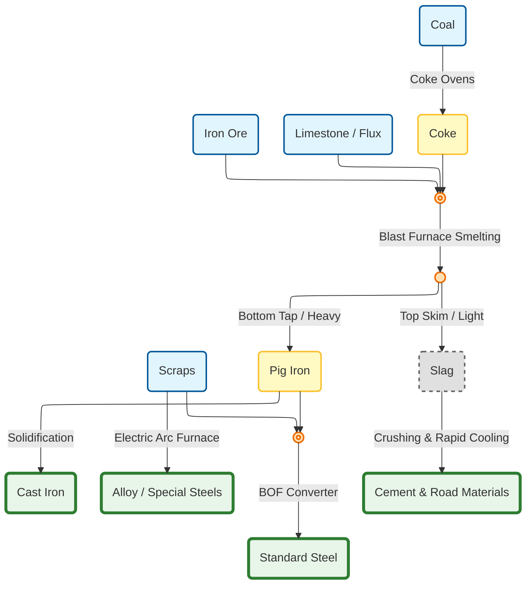

```mermaid
---
config:
  layout: elk
---

graph TD
    Coal(Coal)
    Ore(Iron Ore)
    Flux(Limestone / Flux)
    Scraps(Scraps)

    Coke(Coke)
    Separation((Separation <br/> Density Sorting))
    Pig(Pig Iron)
    Slag(Slag)
    
    Cast(Cast Iron)
    Steel(Standard Steel)
    Alloy(Alloy / Special Steels)
    Cement(Cement & Road Materials)


    Coal -->|Coke Ovens| Coke

    Ore --> CombineBF
    Coke --> CombineBF
    Flux --> CombineBF
    
    CombineBF -->|Blast Furnace Smelting| Separation

    Separation -->|Bottom Tap / Heavy| Pig
    Separation -->|Top Skim / Light| Slag

    Slag -->|Crushing & Rapid Cooling| Cement

    Pig -->|Solidification| Cast
    
    Pig --> CombineBOF
    Scraps --> CombineBOF
    CombineBOF -->|BOF Converter| Steel

    Scraps -->|Electric Arc Furnace| Alloy

    classDef raw fill:#e1f5fe,stroke:#01579b,stroke-width:2px;
    classDef inter fill:#fff9c4,stroke:#fbc02d,stroke-width:2px;
    classDef final fill:#e8f5e9,stroke:#2e7d32,stroke-width:4px;
    classDef waste fill:#e0e0e0,stroke:#616161,stroke-width:2px,stroke-dasharray: 5 5;
    classDef node fill:#ffe0b2,stroke:#ef6c00,stroke-width:2px,shape:circle;
    
    class Coal,Ore,Scraps,Flux raw;
    class Coke,Pig inter;
    class Cast,Steel,Alloy,Cement final;
    class Slag waste;
    Separation@{shape: f-circ, label: "Separate"};

    CombineBF@{ shape: framed-circle, label: "Burden Mix" }
    CombineBOF@{ shape: framed-circle, label: "Charge Mix" }
```

**BOF = Basic Oxygen Furnace** — a structure that heats up carbon-rich pig iron (4-5%) with the presence of a lot of oxygen, allowing carbon to burn off.