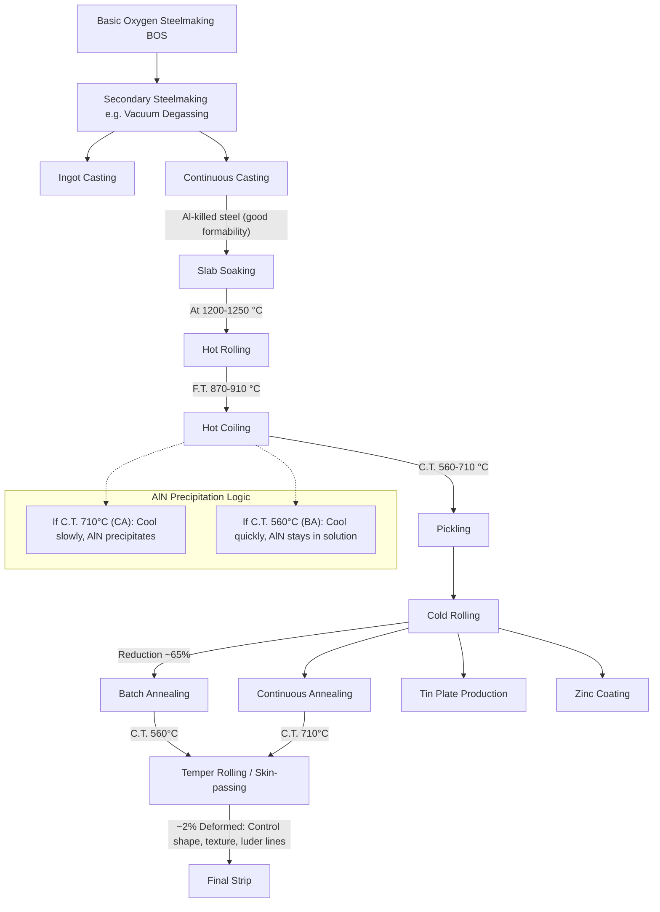

# Heat Treatment of Steels
*Conventional heat treatments for Hypo- and Hyper-eutectoid steels. The goal is to modify microstructure (Grain size, phase distribution) to alter mechanical properties.*

> [!important]+ Reminder from [[Technology of Metallic Materials/Overview of Steels#Non-Equilibrium Phase Diagram]]
> * **$A_1$:** Eutectoid temperature (~727°C). Boundary between Austenite and Pearlite.
> * **$A_3$:** Upper critical temperature for **Hypo**-eutectoid steels (Austenite limit).
> * **$A_{cm}$:** Upper critical temperature for **Hyper**-eutectoid steels (Cementite solubility limit).

![[Technology of Metallic Materials/attachments/Pasted image 20260203164131.png]]

---

## Hypo-Eutectoid Steels ($C < 0.77\%$)

### Normalizing
* **Process:** Heat to **$A_3 + 55^\circ\text{C}$** (Austenitization) $\to$ **Air Cool**.
* **Result:** Moderate grain refinement.
* **Properties:** Harder and stronger than annealed; good mechanical properties at low cost.
* **Microstructure:** Fine Pearlite + Ferrite.

### Full Annealing
* **Process:** Heat to **$A_3 + 30^\circ\text{C}$** $\to$ **Furnace Cool** (Very slow).
* **Result:** Maximum chemical homogenization and softening.
* **Properties:** Maximum ductility, lowest hardness.
* **Microstructure:** Coarse Pearlite + Ferrite.

### Process Annealing
* **Process:** Heat to **$80-170^\circ\text{C}$ below $A_1$**.
* **Result:** Recrystallization of ferrite without phase transformation.
* **Use Case:** Restoring ductility after cold working (strain hardening recovery).

---

## Hyper-Eutectoid Steels ($C > 0.77\%$)

### Normalizing
* **Process:** Heat above **$A_{cm}$** $\to$ Air Cool.
* **Goal:** Break up the brittle Cementite network at grain boundaries.

### Spheroidizing
* **Process:** Pendulum heating (oscillating) around **$A_1$**.
* **Result:** Spheroidization of Pearlite and Cementite.
* **Properties:** The **softest, toughest** possible condition for high-carbon steel.
* **Use Case:** Essential for machinability of high-carbon steels.

---

## Overview of Heat Treatments
* **Austenitization:** Holding at $T$ to dissolve C into $\gamma$-Fe (max solubility/homogeneity).
* **Annealing:** Diffusion-driven. Max softening. Equilibrium microstructure.
* **Normalizing:** Air-cooled. Slightly non-equilibrium. Moderate refinement.

![[Technology of Metallic Materials/attachments/Pasted image 20260203164317.png]]

## Isothermal H.T. On a TTT/CCT Diagram

![[Technology of Metallic Materials/attachments/Pasted image 20260203164503.png]]

> [!check]+ Bainite
> A microstructure of Ferrite and Cementite that forms between the temperature ranges of Pearlite and Martensite (roughly 250°C – 550°C). While martensite is BCT, bainite is BCC.
>
**Formation:** Created via **Austempering** (isothermal holding). You cool the steel fast enough to miss the Pearlite nose, but hold it above the Martensite start ($M_s$) line until it fully transforms.
>
**The Two Types:**
> - **Upper Bainite (400°C – 550°C):** Forms at higher temps. Looks "feathery." The carbides precipitate *between* the ferrite plates. It's tough, but lower bainite is usually better.
> - **Lower Bainite (250°C – 400°C):** Forms at lower temps. Looks like needles (acicular). The carbides precipitate *inside* the ferrite needles. High strength and high toughness.
>
**Why it matters:**
It offers a unique balance. You get hardness similar to tempered martensite but with better ductility and toughness. Plus, since you don't do a violent quench to room temperature, you avoid the internal stresses and cracking risks associated with Martensite.
>
>![[Technology of Metallic Materials/attachments/Pasted image 20260203165503.png]]

> [!note]
> TTT (Time-temperature-Transformation) diagrams show transformations in isotermal environments. In the real world, this is impossible, since materials cannot change temperature instantly.
> CCT (Continuous Cooling Transformation) diagrams show the real world since things cool down gradually. Typically, reactions are slower than in an ideal world, so in a CCT diagram reactions are shifter bottom-right with respect to a TTT diagram.(reactions are slower and happen at lower temperatures).
> 
> ![[Technology of Metallic Materials/attachments/Pasted image 20260203171337.png]]

---
# Quenching

> [!bug]+ Quench Severity Coefficient aka. H-Value
> Describes how aggressively a medium (the liquid the metal is quenched in) cools down the material, with 1 being the baseline and the value for still water.
>
> $Q=HA\Delta T$
>
>| Quench Medium | Agitation? | H Coefficient | Cooling Rate (°C/s)* |
| :--- | :--- | :---: | :---: |
| **Oil** | No | 0.25 | 18 |
| **Oil** | Yes | 1.0 | 45 |
| **Water ($H_2O$)** | No | 1.0 | 45 |
| **Water ($H_2O$)** | Yes | 4.0 | 190 |
| **Brine** | No | 2.0 | 90 |
| **Brine** | Yes | 5.0 | 230 |
>*\*Cooling rate measured at the centre of a 1-inch bar.*

![[Technology of Metallic Materials/attachments/Pasted image 20260204162043.png]]
>In a thick part, the surface cools much faster than the core. The surface transforms to Martensite (and expands) first, creating a hard shell. When the core later tries to expand, it is trapped, leading to high residual stresses and **quench cracking**.
>Quenching cracks are very common in larger pieces.

> [!check]+ Marquenching: the solution to quenching cracks
An interrupted quenching method designed to minimize distortion.
>1.  **Quench:** Rapidly cool to a temperature just above the Martensite Start ($M_s$) point.
>2.  **Hold:** Keep it there until the temperature equalizes (Surface Temp $\approx$ Core Temp).
>3.  **Finish:** Air cool through the Martensite transformation range.
>
>**Benefit:**
>Since the temperature is uniform, the transformation happens simultaneously across the entire cross-section. This drastically reduces residual stress and cracking.
## Residual Austenite ($\gamma_{res}$)

> [!important] Definition
> Austenite that fails to transform into Martensite during quenching because the quench didn't get cold enough (specifically, the temperature didn't drop below $M_f$, the Martensite Finish temp).

**Causes:**
* **High Carbon/Alloy Content:** These elements push the $M_f$ temperature way down (often below 0°C).
* **Stepped Quenching:** Isothermal holding stabilizes the Austenite.

**Consequences:**
1.  **$\downarrow$ Hardness & Fatigue Strength:** Soft spots in the hard martensite matrix.
2.  **Dimensional Instability:** The residual $\gamma$ will eventually transform later in service. This transformation causes [[Technology of Metallic Materials/Strengthening of Steels#Volumetric Expansion & Distortion]].
3.  **Internal Stresses:** The delayed expansion creates new internal stress.

**Solutions:**
* **Cryogenic Treatment:** Continue quenching into sub-zero temperatures (Liquid Nitrogen at -150°C or Dry Ice at -80°C) to force the cross of the $M_f$ line.
* **Multiple Tempering:** Execute two or more [[Technology of Metallic Materials/Strengthening of Steels#Tempering]] cycles to decompose the retained austenite into stable phases.

![[Technology of Metallic Materials/attachments/Pasted image 20260204161913.png]]

---
# Volumetric Expansion & Distortion

![[Technology of Metallic Materials/attachments/Pasted image 20260204153034.png]]

* **Thermal Contraction:** As temperature drops, the metal *wants* to shrink.
* **Phase Transformation:** As Austenite turns into Martensite (or Ferrite), the crystal lattice wants to expand.

* **Austenite (FCC):** Ideally packed atoms. High density.
* **Martensite/Ferrite (BCC/BCT):** Loosely packed atoms. Low density.
* **The Result:** When the phase flips, the volume suddenly increases by roughly **1%**.

This phenomenon can cause huge internal stresses, which can lead to quenching cracks or overwhelming deformations of the object.

---
# Tempering

> [!important]+ Definition
> Tempering is a heat treatment process, mainly for metals like steel, that involves reheating a hardened material to a specific temperature below its critical point and then cooling it slowly to reduce brittleness, increase toughness, and relieve internal stress, creating a better balance of strength and ductility for practical use.
> > [!note]- Graph
> > ![[Technology of Metallic Materials/attachments/Pasted image 20260204161728.png]]

![[Technology of Metallic Materials/attachments/Pasted image 20260204155454.png]]

> [!important]+ Temper Embrittlement (Krupp's Illness)
Normally, tempering increases toughness ($K$). However, if you hold the steel in the **400°C – 550°C** range (or cool slowly through it), the toughness drops dramatically.
>
You ruin the steel if you do any of these:
>* Temper it specifically inside the **400-550°C** range.
>* Temper it *above* this range (>600°C) but then **cool it slowly** through the danger zone.
>* Hold it in this range for too long during service.
>
> **The Result:**
>* **Fracture Mode:** Intergranular (the metal cracks along the grain boundaries because impurities segregate there).
>* **Reversibility:** It is **reversible**. You can fix it by reheating above 600°C and quenching.
>
**Who is Vulnerable?**
>* **Safe:** Plain Carbon Steels (with $Mn < 0.7\%$) are immune.
>* **At Risk:** Low alloy steels with high **$Mn$** or **$Cr$**.
>* **High Risk:** Steels with coarse grains (more segregation).
>
>**How to fix it**
>1.  **The Alloying Fix:** Add **$Mo$ (>0.2%)** or **$W$ (0.4%)**. This is why Chrome-Moly steel is great: the Molybdenum blocks the impurities from moving to the boundaries.
>2.  **The Process Fix:** If you temper at high temps (>600°C), quench the part afterwards. Do *not* furnace cool it. You must “jump over” the 550-400°C gap quickly.
>
>**Why it Happens**
>- Impurities precipitate on grain boundaries at that temperature range
>- $Cr,Mn$  combine with impurities, separating from the main alloy.
>- $Mo,W$ are more stable in their carbide forms and therefore do not react with impurities.

## Tempered Martensite

Martensite is extremely hard and brittle. After tempering, the cementite phase turns into spheroidal shapes. The tempering is done at 250-650 °C. This reduces internal stresses and increases toughness.

![[Technology of Metallic Materials/attachments/Pasted image 20260204153612.png]]
![[Technology of Metallic Materials/attachments/Pasted image 20260204153719.png]]

## Tempered Carbon Steels

![[Technology of Metallic Materials/attachments/Pasted image 20260204153756.png]]

| Element                    | Primary Roles                       | Advantages                                                                                                               | Disadvantages                                                             | Notes                                                  |
| :------------------------- | :---------------------------------- | :----------------------------------------------------------------------------------------------------------------------- | :------------------------------------------------------------------------ | :----------------------------------------------------- |
| **$C$**                    | Hardener.                           | $\uparrow$ Yield Strength, $\uparrow$ Hardness (HRC), $\uparrow$ Hardenability                                           | $\downarrow$ Toughness (CVN)                                              | Combines with $Cr, Ti, Ta, W, V, Mo$ to form carbides. |
| **$Mn$**                   | Hardenability Agent & Austenitizer. | Massive $\uparrow$ Hardenability (H), Strong Austenitizer (after $Ni$)                                                   | $\downarrow$ Ductility, $\downarrow$ Weldability (as concentration rises) | Role depends on %$C$.                                  |
| **$Al$**                   | Deoxidizer & Grain Refiner.         | Powerful deoxidizer in the melt, refines grain size                                                                      | Detrimental if > 0.1%                                                     | Used in "killed" steels.                               |
| **$Si$**                   | Deoxidizer & Elasticity Booster.    | $\uparrow$ Elastic Limit, Deoxidizer (less than $Mn$)                                                                    | Detrimental to surface finish if excessive                                | Less effective than $Mn$ for HRC.                      |
| **$Cu$**                   | Corrosion Shield.                   | $\uparrow$ Corrosion Resistance (Rcorr) (if 0.2% - 0.5%)                                                                 | $\downarrow\downarrow$ Surface finish in hot-worked steels if excessive   | Keep < 0.5%.                                           |
| **$Ni$**                   | Ferrite Strengthener & Toughener.   | $\uparrow$ Tensile Strength (UTS) *while maintaining* high Toughness and Ductility. Strong Austenitizer                  | *None*                                                                    | Stays in solid solution; best all-rounder.             |
| **$Mo$**                   | Best for high temperature.          | $\uparrow$ Creep Resistance at high T, $\uparrow\uparrow$ Hardenability (H)                                              | *None*                                                                    | Overcomes temper-embrittlement.                        |
| **$B$**                    | Increases hardenability.            | $\uparrow\uparrow\uparrow$ [[Technology of Metallic Materials/Overview of Steels#Hardenability\|Hardenability]] (H)                                       | *None*                                                                    | -                                                      |
| **$Cr, Ti, Ta, W, Nb, V$** | Grain Refiners & Hardeners.         | $\uparrow\uparrow$ Hardness (HRC) without depressing toughness, $\uparrow$ Wear Resistance, $\uparrow$ High T Resistance | *None*                                                                    | Strong carbide formers and grain refiners.             |
