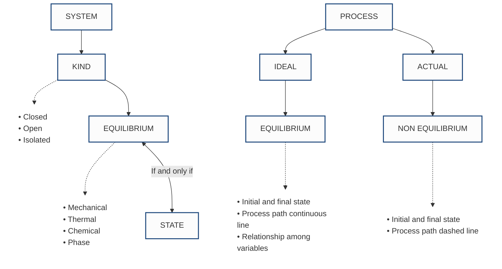

> [!ABSTRACT]- What is a "System"
> A thermal system is whatever we want to study:
> - Quantity of matter in space
> - Can be simple (free body) or complex (e.g. Power plant)
> - The composition of matter may change due to (chemical/physical) reactions or not
> - The quantity of matter may be fixed or not
>   
>   The **Surroundings** is the mass or region *outside* the system. It is divided from the system by a real or ideal boundary. The boundary:
>   - Can be fixed or movable (e.g. Piston assembly vs gas tank)
>   - Is the median of interaction between system and surroundings
>   - Is the contact surface between system and surroundings
>
> The union of **surroundings** and **system** is called the **universe**.
> 
## Closed systems
- No mass transfers across the boundary.
- Mass is constant.
- Energy **can** be transferred through the boundaries.

## Open Systems
- Mass can flow in and out with **mass flow rate** $\dot{m}$ measured in $kgs^{-1}$.
- This type of system requires a defined *"Control Volume"*  through which mass can flow
- Mass may or may not vary within the system
- Energy transfers across the boundary are obviously also allowed.

# Isolated Systems
- The system does **NOT** interact with surroundings in ANY way
	- No mass is transferred
	- No energy is transferred

> [!EXAMPLE] The universe is an example of a real isolated system: Both mass and energy are conserved!

---
## System Properties

> [!TIP]+ Definition
> A macroscopic feature of the system (e.g. Mass, volume, temperature, etc.)
> To describe the system, a subset of properties is sufficient.
> 
> Properties can be **Extensive** or **Intensive**.
> 
> > [!WARNING] Extensive vs. Intensive Properties
> > - **Extensive** properties are ones who's numerical value is proportional to quantity of matter contained within the system (e.g. Mass, potential, kinetic energy, etc.)
> > - **Intensive** properties are ones who's numerical value is independent of the quantity of matter in the system (e.g. Pressure, temperature, etc.)
> > - **Specific Properties** are the ratio between two extensive properties, such as specific volume ($v=\frac{V}{m}$)
> 
> The combination of properties which describe the condition of the system is the **state** of the system (the state is the condition).
> - There are usually relations between properties in a system (e.g. $pV=nRT$)
> - A **steady state** is one who's properties do NOT change.

## Equilibrium
A system is in thermodynamic equilibrium if it is in:
- Mechanical equilibrium 
	- Constant force and pressure everywhere in the system
- Thermal equilibrium
	- Constant temperature everywhere in the system
- Chemical equilibrium
	- No change over time of chemical composition due to chemical reaction
- Phase equilibrium
	- No variation in phase and chemical composition

### Quasi-Equilibrium Process
_a.k.a. Quasi-static_

A process that proceeds in such a manner that the system remains infinitesimally close to an equilibrium state at all times.
- It's an idealized process.
- Departure from equilibrium is at most infinitesimal.
- The whole system can be described by using only a numerical value for each property.

> [!WARNING] Real Processes
> A real process is only in equilibrium at the beginning at the end. In other parts there is a spatial variation in properties, reactions can occur, etc. leading to a state of non-equilibrium.

---
# Thermodynamic Processes
> [!TIP]+ Process
> A transformation in which a system changes its state (and therefore properties).
> 
> The **Path** is a series of equilibrium states through which a system passes during a process.
> 
> > [!EXAMPLE]-
> > ![[Pasted image 20260223112255.png]]

> [!BUG]+ Thermodynamic Cycle
> The series of processes that begins and ends at the same state.
> 
> **NO NET CHANGE OF STATE OCCURS**
> ![[Pasted image 20260223112503.png]]
> 
> *Properties are independent of the details of the process.*

---
# Summary

