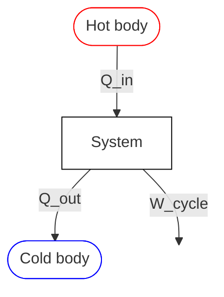
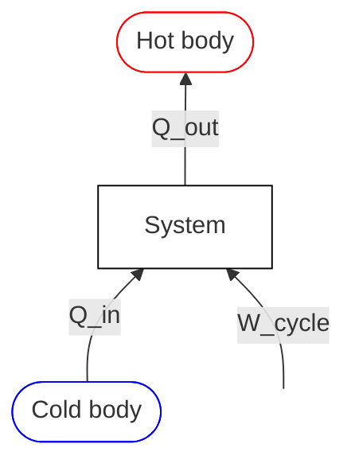

Thermal [[1. Systems|systems]] involve:
- Energy storage
- Energy transfer
- Energy conversion

Energy can be subdivided into two groups:
- Macroscopic forms
	- What the system has with respect to a frame of reference
- Microscopic forms
	- Related to molecular activity and are independent of any external reference frame

> [!TIP] Energy is an [[1. Systems#System Properties|extensive property]].

# Heat
[[1. Systems#Open Systems|Open]] and [[1. Systems#Closed systems|closed]] systems can exchange heat with their surroundings across their boundaries.

- The unit for $Q$ is $J$, and heat per unit mass $q$ in $Jkg^{-1}$
- Rate of heat transfer is $\dot{Q}$, measured in $W=Js^{-1}$

- Heat transfer occurs at a system boundary, and is therefore a **Boundary Phenomenon**.
- The system has a certain energy but NOT a certain heat.
- It is a **path function:** the amount of heat exchanged depends on the path followed during the process as well as on the initial and the final states.
	- A process with no heat transfer is called **adiabatic**

> [!IMPORTANT]+ Sign Convention
> 
> $$
> \begin{align}
> &Q>0 \implies \text{Heat entering the system} \\
> &Q<0 \implies \text{Heat exiting the system}
> \end{align}
> $$

# Work

$$
W=Fd=wm=\int_{t_{1}}^{t_{2}}\dot{W}\cdot dt
$$
> [!IMPORTANT]+ Sign Convention
> 
> $$
> \begin{align}
> &W>0 \implies \text{Work transferred FROM the system} \\
> &W<0 \implies \text{Work transferred TO the system}
> \end{align}
> $$

Just like [[#Heat]], work is not a property because it does not depend on the current state of the system. It is instead path-dependent. 

## Gas Expansion

![[Pasted image 20260223121719.png]]

When gas expending performs work on surface area $A$,

$$
\partial W=pA\cdot dx=F\cdot dx
$$

> [!IMPORTANT] Sign Convention
> $$
> \begin{align}
> \text{Expansion}&\implies \partial W>0 \\
> \text{Compression}&\implies \partial W<0
> \end{align}
> $$

Total Work:

$$
W=\int_{V_{1}}^{V_{2}}p\cdot dV
$$

> [!WARNING]- Real Processes
> ![[Pasted image 20260223121810.png]]
> 
> In real processes, an exact relation between $p$ and $V$ does not exist, so work must be found in another way.

---
## Claperyon Diagram

![[Pasted image 20260223122453.png]]

$$
W=\text{Area}=\int_{v_{1}}^{V_{2}}p\cdot dV
$$

> [!WARNING]-
> The above diagram and integral ONLY apply for equilibrium processes (quasi-static). For non-equilibrium processes, we must use other methods.

> [!EXAMPLE]- Path-Dependance of Work
> ![[Pasted image 20260223122807.png]]

---
# First Law of Thermodynamics

> [!IMPORTANT] The Law
> > Energy can be neither created nor destroyed during a process, it can only change form
> 
> OR
> 
> > The net change (increase or decrease) in the total energy of the system during a process is equal to the difference between the total energy entering and the total energy leaving the system during the process

Total **energy** in a system is given by the total:
- Kinetic energy
- Internal energy
- Potential energy
A closed system gains or loses energy by exchanging **heat** or **work** with the surrounding.

$$
\begin{align}
\Delta E&=Q-W \\
\Delta E_{K}+\Delta U+\Delta E_{P}&=Q-W
\end{align}
$$

In a closed system we can assume:

$$
\begin{align}
&\Delta E_{K}=0,&\Delta E_{P}\approx 0 \\
&\implies \Delta U\approx Q-W
\end{align}
$$

For a thermodynamic cycle in a closed system:

$$
\Delta E_{\text{cycle}}=\Sigma Q-\Sigma W=0
$$

> What this means is that any work done to the system by the surrounding is eventually re-emitted as heat and vice versa.

---
# Efficiency

## Thermal Efficiency

> [!TIP] Thermal Efficiency
> $$
> \eta=\frac{W_{\text{cycle}}}{Q_{\text{in}}}=\frac{{Q_{\text{in}}-|Q_{\text{out}}|}}{Q_{\text{in}}}<1
> $$

---
## Coefficient of Performance

### For Refrigeration

> [!IMPORTANT] Coefficient of Performance
> $$
> \beta=\frac{Q_{\text{in}}}{|W_{\text{cycle}}|}=\frac{Q_{\text{in}}}{|Q_{\text{out}}|-Q_{\text{in}}}
> $$

### For Heat Pumps
$$
\gamma = \frac{|Q_{out}|}{|W_{cycle}|} = \frac{|Q_{out}|}{-Q_{in} + |Q_{out}|} = \frac{|Q_{out}| + Q_{in} - Q_{in}}{-Q_{in} + |Q_{out}|}
$$

$$
\gamma = 1 + \frac{Q_{in}}{-Q_{in} + |Q_{out}|} = 1 + \beta
$$

