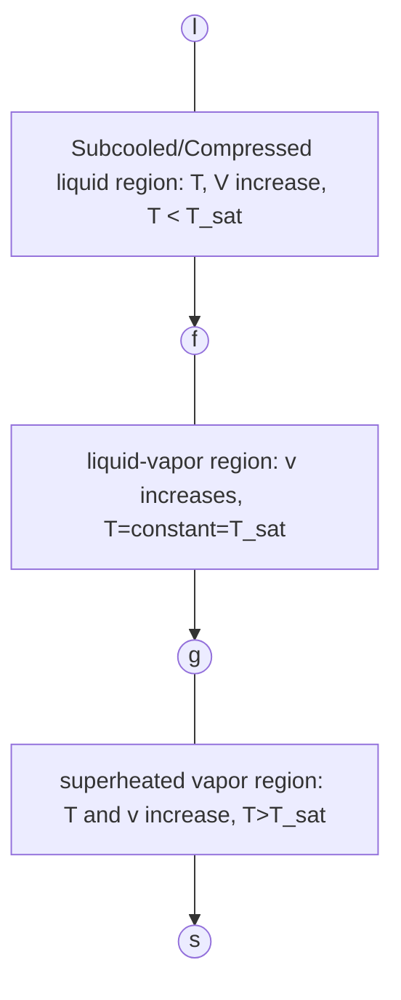

## Definitions

| Term                       | Definition                                                                                                                                        |
| -------------------------- | ------------------------------------------------------------------------------------------------------------------------------------------------- |
| Simple Compressible System | A system for which electrical, magnetic, gravitational, motion and surface tension effects are negligible                                         |
| State Postulate            | The state of a simple compressible system is completely specified by using two independent [[1. Systems#System Properties\|intensive properties]] |

---
# Water
![[Pasted image 20260225152234.png]]
> The above diagram is for equilibrium states.

> [!NOTE]
> For water, $P,V$ can be considered independent. 

- **Triple Line:** The point where 3 phases exist at equilibrium. 
  
 $$
\begin{align}
T=0.01°C&&P=6.1\times 10^{-3}\,\text{bar}
\end{align}  
$$
- **Vapour Dome:** The region where liquid and vapour coexist
- **Critical Point:** Maximum point in $P,T$ where the *vapour dome* exists

$$
\begin{align}
T_{C}=373.75°C&&P_{C}=220\,\text{bar}
\end{align}
$$

- **In the two-phase regions:** processes at constant pressure are also at constant temperature and vice versa.
- **In the single-phase regions:** at a fixed temperature, when the pressure decreases the specific volume increases.
- **In the single-phase regions:** at constant pressure, temperature increases when the specific volume increases

> [!CHECK]- Diagrams
> ![[Pasted image 20260225153319.png]]

## Vapour Dome

![[Pasted image 20260225153645.png]]

| Term                            | Definition                                                                                      |
| ------------------------------- | ----------------------------------------------------------------------------------------------- |
| Saturation State                | State at which the phase change starts or ends.                                                 |
| Saturation Temperature/Pressure | The temperature/pressure at which the phase change takes place at a given pressure/temperature. |
| Saturated liquid/vapour line    | The lines bordering the left and right sides of the vapour dome.                                |
| Critical point                  | Point at which saturated liquid and saturated vapour lines meet.                                |

> [!BUG] Bibb's Rule
> $$
> \begin{align}
> V&=C-F+2 \\
> \text{Number of independent variables required}&=\text{Number of mixture components}-\text{Number of phases}+2
> \end{align}
> $$

---
## Phase Change at Constant Pressure

![[Pasted image 20260225154559.png]]

---
## Mixture Quality

$$
X=\frac{m_{\text{vap}}}{m_{\text{liq}}+m_{\text{vap}}}
$$

$$
0\leq x\leq 1
$$

![[Pasted image 20260225155434.png]]

$$
\begin{align}
V_{A}=V_{liq}+V_{vap}&&\begin{matrix}
V_{liq}&=m_{liq}v_{f} \\
V_{vap}&=m_{vap}v_{g}
\end{matrix}
\end{align}
$$

$$
V_A = \left(\frac{m_{liq}}{m}\right) \cdot v_f + \left(\frac{m_{vap}}{m}\right) \cdot v_g
$$

$$
v_A = (1 - x_A) \cdot v_f + (x_A) \cdot v_g
$$

---

## Finding Properties of Water

### Saturation Tables

![[Pasted image 20260227115816.png]]

![[Saturation tables.pdf]]
### Subcooled Liquid and Superheated Vapour Tables

![[Pasted image 20260227115747.png]]

#### Enthalpy

$$
\begin{align}
H=U+pV&&h=u+pv
\end{align}
$$

$$
\begin{align}
[H]=J &&[h]=Jkg^{-1}
\end{align}
$$

> [!NOTE] Enthalpy is an [[1. Systems#System Properties|extensive property.]]

---
### Specific Heat
> [!NOTE] Specific heat $c$ is an [[1. Systems#System Properties|intensive property]].

$$
[c]=Jkg^{-1}K^{-1}
$$

> [!abstract] Compressible Substances
> The state postulate mandates $2$ independent intensive variables to fix the state.
> 
> **Internal Energy ($u$)** is a function of $(T, v)$:
> - $du = \left(\frac{\partial u}{\partial T}\right)_v dT + \left(\frac{\partial u}{\partial v}\right)_T dv$
> - **Definition:** $c_v = \left(\frac{\partial u}{\partial T}\right)_v$
> 
> **Enthalpy ($h$)** is a function of $(T, p)$:
> - $dh = \left(\frac{\partial h}{\partial T}\right)_p dT + \left(\frac{\partial h}{\partial p}\right)_T dp$
> - **Definition:** $c_p = \left(\frac{\partial h}{\partial T}\right)_p$
> 
> **Ratio:** $c_p / c_v > 1$

> [!note] Incompressible Substances
> Specific volume ($v$) is constant regardless of the process.
> - $u = u(T)$ (Internal energy relies entirely on temperature).
> - Specific heats are equal: $c_p = c_v = c(T) = \frac{du}{dT}$

> [!example] State Changes (Incompressible)
> **Change in Internal Energy ($\Delta u$)**
> 
> $$
> u_2 - u_1 = \int_{1}^{2} c(T) \,dT
> $$
> 
> *If $c$ is constant:* $u_2 - u_1 = c(T_2 - T_1)$
> 
> **Change in Enthalpy ($\Delta h$)**
> Since $h = u(T) + pv$:
> 
> $$
> h_2 - h_1 = \int_{1}^{2} c(T) \,dT + v(p_2 - p_1)
> $$
> 
> *If $c$ is constant:* $h_2 - h_1 = c(T_2 - T_1) + v(p_2 - p_1)$

---
# Ideal Gas
> [!NOTE] 
> $\bar{v}$ is the specific molar volume, measured in $m^{3}mol^{-1}$

$$
\begin{align}
&\lim_{ p \to 0 } \left( \frac{p\bar{v}}{T} \right)=\text{constant} \\
&\implies\lim_{ p \to 0 } (p\bar{v})=f(T)
\end{align}
$$

> [!EXAMPLE]- Ideal Gas Thermometer
> Since $V\propto T$ ceteris paribus, we can use an ideal gas as a thermometer. At $T=0K$ we get $V=0$ (thermodynamically impossible though) and as $T$ increases, $V$ increases linearly, making it easy to create a linear temperature scale by using a frictionless piston holding the gas.
> 
> This is flawed in real life since an ideal gas does not exist, and the real gas laws do not guarantee $V\propto T$.

$$
f(T)=\frac{f(T_{tp})}{273.16}\cdot T=\lim_{ p \to 0 } (p\bar{v})
$$
> The above formula is a universal law independent of the gas law.
> $T_{tp}$ is the temperature at the [[#Water|triple point of water]].

$$
\bar{R}=\frac{f(T_{tp})}{273.16}=8.314\,Jmol^{-1}K^{-1}
$$

$$
\begin{align}
pV=mRT \\
p\bar{v}=\bar{R}T
\end{align}
$$

Using $MM=\text{Molar Mass}$:

$$
\begin{align}
R&=\frac{\bar{R}}{MM} \\
\bar{v}&=v\cdot MM \\
n&=\frac{m}{MM}
\end{align}
$$

---
# Compressibility Factor
> A straightforward metric to gauge how much a real gas strays from ideal behaviour.

> [!abstract] The Mathematics
> **State Equation:** > A relationship connecting three state functions: $p = p(v,T)$.
> 
> **Defining $Z$:** 
> $$
> Z = \frac{p \cdot v}{R \cdot T} = Z(v,T)
> $$
> 
> **The Ideal Baseline:** > For a perfectly ideal gas, $Z = 1$.

> [!note] Observing Real Gases
> - The further $Z$ drifts from $1$, the less ideal the gas behaves in reality.
> - Gas behaviour becomes nearly ideal ($Z \to 1$) when it is subjected to very low pressures and highly elevated temperatures relative to its specific thermodynamic thresholds.

---
