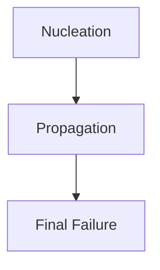

> [!DEFINITION]+ Fatigue
> The progress of progressive, localized, permanent structural change occurring in a material subjected to conditions that produce fluctuating stresses and strains at some point(s) and that may culminate in cracks or complete fracture after sufficient number of fluctuations.
> _(ASTM E 1823-2013)_

> [!TIP]+ Stress/Strain Cycle
> ![[Pasted image 20260926134024.png]]
> 
> Requires the following parameters to be defined:
> - Time parameter $t$
> - Two Amplitude parameters (defining minimum and maximum stress or strain)
>   
>   $$
> R=\frac{\sigma_{min}}{\sigma_{max}}  
> $$
> 
> $R$ is the **Stress Ratio**

## Constitutive Equations
_For elastic materials_

$$
\begin{align}
[\sigma] & =[H][\varepsilon] \\
\implies[\varepsilon] & =[H]^{-1}[\sigma] \\
\begin{bmatrix}
\epsilon_{x} \\
\epsilon_{y} \\
\epsilon_{z} \\
\gamma_{xy} \\
\gamma_{yz} \\
\gamma_{zx}
\end{bmatrix}  & =\begin{bmatrix}
\frac{1}{E} & -\frac{\nu}{E} & -\frac{\nu}{E} & 0 & 0 & 0 \\
-\frac{\nu}{E} & \frac{1}{E} & -\frac{\nu}{E} & 0 & 0 & 0 \\
-\frac{\nu}{E} & -\frac{\nu}{E} & \frac{1}{E} & 0 & 0 & 0 \\
0 & 0 & 0 & \frac{1}{G} & 0 & 0 \\
0 & 0 & 0 & 0 & \frac{1}{G} & 0 \\
0 & 0 & 0 & 0 & 0 & \frac{1}{G}
\end{bmatrix}\begin{bmatrix}
\sigma_{x} \\
\sigma_{y} \\
\sigma_{z} \\
\tau_{xy} \\
\tau_{yz} \\
\tau_{zx}
\end{bmatrix}
\end{align}
$$

With:

$$
G=\frac{E}{2(1+\nu)}
$$
---
## Static vs Fatigue Failure

> [!Diagram]+ 
> ![[Pasted image 20260926135234.png]]

A ductile material fails with an apparently brittle surface (no shear planes visible, instead it cracks perpendicularly to the load).

### Phases of Crack Propagation

> [!DIAGRAM]+
> ![[Pasted image 20260926135703.png]]

> [!EXAMPLE]- Different failure appearences
> ![[Pasted image 20260926140208.png]]

> [!DIAGRAM]- Wöhler (S-N) Diagram
> ![[Pasted image 20260926141816.png]]
> 
> UNS G41300 Steel:
> ![[Pasted image 20260926141954.png]]

---
# Effect of Loading Type on Fatigue Limit

Fatigue limits depend on the **type of loading**. For fully reversed loading ($R=-1$), **rotating bending** is the reference unless otherwise stated:

$$
\sigma_{D-1}=\sigma_{D-1,rb}
$$

| Loading                    | Description                                | Fatigue limit                                         |
| -------------------------- | ------------------------------------------ | ----------------------------------------------------- |
| Rotating bending (`rb`)    | Shaft rotates under a fixed bending moment | Reference                                             |
| Plane bending (`pb`)       | Bending moment reverses in a fixed plane   | $\sigma_{D-1,pb}\approx\sigma_{D-1,rb}$               |
| Tension–compression (`TC`) | Alternating axial pull and push            | $\sigma_{D-1,TC}\approx(0.65\div0.77)\sigma_{D-1,rb}$ |
| Alternating torsion (`AT`) | Alternating twisting direction             | Shear fatigue limit $\tau_{D-1,AT}$                   |

> [!NOTE]+ Why is the axial fatigue limit lower?
> Axial loading highly stresses the entire cross-section; bending reaches maximum stress only at the outer surface. A larger highly stressed volume increases the opportunity for fatigue initiation.

> [!IMPORTANT]+ Empirical factors
> These multipliers come from experiments and depend on the material and test conditions.
> The slide's $\div$ symbol means “to”, indicating a range.

> [!WARNING]+ Check the torsion coefficient
> The slide gives $\tau_{D-1,AT}\approx(0.8\div0.85)\sigma_{D-1,rb}$.
> A common steel approximation is about $0.58\sigma_{D-1,rb}$; Is professor stoopid?

---
# Dispersion of Fatigue Data

> [!IMPORTANT]+
> Fatigue is an intrinsically dispersed phenomenon. Meaning that its outcome is not a determinate single value, but a statistical phenomenon.
> 
> ![[Pasted image 20260926143124.png]]

## Staircase Method

Estimates the **fatigue strength at a chosen cycle count** and its statistical scatter by testing several specimens.

### Procedure

1. Test a specimen at a chosen stress amplitude.
2. **Failure (`×`)** before the target cycle count → decrease stress by $d$.
3. **Run-out (`○`)**: survives the target cycle count → increase stress by $d$.
4. Repeat with a **new specimen** each time.

> [!NOTE]+ Run-out
> Survival up to the chosen cycle count does **not** prove infinite life.

### Statistical Evaluation

Use only the **less frequent outcome** (failures or run-outs).

- $\sigma_0$: lowest stress level at which that outcome occurred.
- $i=(\sigma_i-\sigma_0)/d$: stress-level index, starting at $0$.
- $n_i$: number of selected outcomes at level $i$.

$$
m=\sum n_i,\qquad A=\sum i n_i,\qquad B=\sum i^2n_i
$$

> [!NOTE]+ Notation
> Here $m$ is the selected outcome count; the slide calls it $N$, also used for the target cycle count.

The stress amplitude giving **50% probability of failure** by the target cycle count is estimated as:

$$
\sigma_{N(50\%)}=\sigma_0+d\left(\frac{A}{m}\pm0.5\right)
$$

- Use $+$ when **run-outs** are less frequent.
- Use $-$ when **failures** are less frequent.

### Scatter and Failure Probability

Define:

$$
q=\frac{mB-A^2}{m^2}
$$

The estimated standard deviation is:

$$
s=
\begin{cases}
1.62d(q+0.029), & q>0.3\\
0.53d, & q\leq0.3
\end{cases}
$$

Assuming a normal distribution of fatigue strength:

$$
\begin{aligned}
\sigma_{N(10\%)}&=\sigma_{N(50\%)}-1.28s\\
\sigma_{N(90\%)}&=\sigma_{N(50\%)}+1.28s
\end{aligned}
$$

> [!IMPORTANT]+ Probability of failure
> These percentages refer to **failure**, not survival.
> The 10% failure level corresponds to 90% survival.

> [!EXAMPLE]- Slide: M8 screws, target $5\times10^6$ cycles
> Run-outs are less frequent: $m=7$, $A=9$, $B=15$.
> With $\sigma_0=30$ MPa and $d=10$ MPa:
> - $\sigma_{N(50\%)}\approx47.9$ MPa
> - $s\approx8.4$ MPa
> - $\sigma_{N(10\%)}\approx37.1$ MPa
> - $\sigma_{N(90\%)}\approx58.6$ MPa

> [!TLDR]-
> Whatever the fuck this slide is:
> 
> ![[Pasted image 20260926143558.png]]

